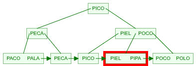
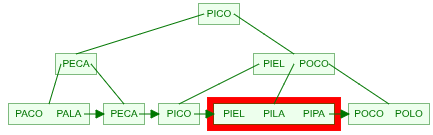
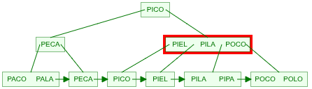
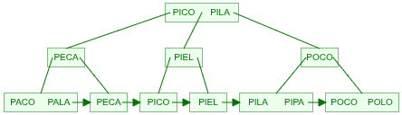

---
jupytext:
  formats: md:myst
  text_representation:
    extension: .md
    format_name: myst
kernelspec:
  display_name: Python 3
  language: python
  name: python3
---

# Árboles B - Índices ordenados

```{code-cell} python
---
tags: [hide-output, remove-cell]
---
"""Borra todos los archivos y carpetas en /tmp"""
import os
import shutil

tmp_dir = "/tmp"
os.chdir(tmp_dir)
for filename in os.listdir(tmp_dir):
    file_path = os.path.join(tmp_dir, filename)
    try:
        if os.path.isfile(file_path) or os.path.islink(file_path):
            os.remove(file_path)
        elif os.path.isdir(file_path):
            shutil.rmtree(file_path)
    except Exception as e:
        print(f"No se pudo borrar {file_path}: {e}")
```

Con los índices invertidos hemos visto cómo organizar la información para acelerar las búsquedas por términos. Sin embargo, en muchos casos es necesario realizar búsquedas con comodines o rangos, como por ejemplo:

- Buscar todos los documentos que contengan términos que empiecen con `"comput*"`{l=python}.
- Buscar documentos con fechas entre `"2020-01-01"`{l=python} y `"2020-12-31"`{l=python}.
- Buscar productos con precios entre `100`{l=python} y `500`{l=python}.
- Buscar nombres de usuarios que contengan la cadena `"admin"`{l=python}.

Para estos casos, los índices invertidos no son la mejor opción, ya que están optimizados para búsquedas exactas de términos. En su lugar, se utilizan **índices ordenados** basados en estructuras de datos como los **árboles B**.

## ¿Qué es un Árbol B?

Un árbol B es una estructura de datos autoequilibrada que mantiene los datos ordenados y permite búsquedas, inserciones y eliminaciones en tiempo logarítmico. Los árboles B son especialmente útiles para sistemas de bases de datos y sistemas de archivos debido a su capacidad para manejar grandes cantidades de datos y minimizar las operaciones de lectura/escritura en disco.

Un árbol-B de orden $M$ (el máximo número de hijos que puede tener cada nodo) es un árbol que satisface las siguientes propiedades:

- Cada nodo tiene como máximo $M$ hijos.
- Cada nodo (excepto la raíz) tiene como mínimo $\left\lceil \frac{M}{2} \right\rceil$ claves.
- Si la raíz no es una hoja, entonces debe tener al menos 2 hijos.
- Todos los nodos hoja aparecen al mismo nivel.
- Un nodo no hoja con $k$ hijos contiene $k-1$ elementos o claves almacenados.
- Los hijos de un nodo con claves $(k_1, \dots, k_m)$ tienen que cumplir ciertas condiciones:
  - El primer hijo tiene valores menores que $k_1$.
  - El segundo tiene valores mayores o igual a $k_1$ y menores que $k_2$, etc.
  - El último hijo tiene valores mayores que $k_m$.

Para construir índices usaremos árboles B+, una variante de los árboles B en la que:

- Todos los valores se almacenan en las hojas.
- Los nodos internos solo almacenan claves para guiar la búsqueda.
- Las hojas están enlazadas entre sí para facilitar recorridos secuenciales.

## Ejemplo de árbol B+

Consideremos un árbol B+ de orden 3 (cada nodo puede tener hasta 3 hijos) que almacena las siguientes palabras: `"PACO"`{l=python}, `"POCO"`{l=python}, `"PECA"`{l=python}, `"PICO"`{l=python}, `"PALA"`{l=python}, `"POLO"`{l=python}, `"PIEL"`{l=python} y `"PIPA"`{l=python}. El árbol se vería así:

```{figure} ../assets/images/bplus1.png
---
name: bplus1
---
Árbol B+ de orden 3.
```

En la figura se observa que los nodos internos contienen las claves que guían la búsqueda, mientras que las hojas contienen las palabras completas. Además, las hojas están enlazadas entre sí para facilitar la búsqueda secuencial, lo que facilita la búsqueda con comodines o rangos.

En cada nodo pueden haber como máximo 2 claves (orden 3) y como mínimo 1 clave ($\left\lceil \frac{3}{2} \right\rceil - 1 = 1$) y las palabras dentro de cada nodo están ordenadas alfabéticamente.

En los nodos intermedios y en la raíz se repiten palabras que ya están en las hojas, de tal manera que las palabras estrictamente menores a una clave dada se encuentran en el subárbol izquierdo y las palabras mayores o iguales a esa clave se encuentran en su subárbol derecho.

En el ejemplo si se busca `"PILA"`{l=python} como es mayor que la clave en la raíz, la búsqueda continúa en el subárbol derecho. El nodo intermedio contiene las palabras `"PIEL"`{l=python}|`"POCO"`{l=python}, como `"PILA"`{l=python} es mayor que `"PIEL"`{l=python}, pero menor que `"POCO"`{l=python}, la búsqueda continúa en el subárbol del medio. Al llegar a la hoja con las palabras `"PIEL"`{l=python}|`"PIPA"`{l=python}, se determina que `"PILA"`{l=python} no está en el árbol.

## Inserción en un Árbol B+

La inserción de un nuevo valor en un árbol B+ sigue estos pasos:

1. **Buscar la hoja adecuada**: Se comienza en la raíz y se desciende por el árbol siguiendo las claves hasta llegar a la hoja donde debería insertarse el nuevo valor.
2. **Insertar el valor**: Si la hoja tiene espacio (menos de $M-1$ claves), se inserta el nuevo valor en orden.
3. **Dividir la hoja si es necesario**: Si la hoja está llena (tiene $M-1$ claves), se divide en dos hojas. La clave mediana se promueve al nodo padre.
4. **Actualizar el nodo padre**: Si el nodo padre también está lleno, se repite el proceso de división y promoción hacia arriba hasta llegar a la raíz.
5. **Crear una nueva raíz si es necesario**: Si la raíz se divide, se crea una nueva raíz con la clave promovida.

{align=center}

{.centered}
Se encuentra la hoja donde se debe insertar `"PILA"`{l=python}.

{align=center}

{.centered}
Al insertar `"PILA"`{l=python}, la hoja se divide en dos, la primera contiene `"PIEL"`{l=python} y la segunda `"PILA"`{l=python}|`"PIPA"`{l=python}.

{align=center}

{.centered}
Como `"PILA"`{l=python}, es la primera clave del segundo nodo que se partió, se promueve hacia arriba.

{align=center}

{.centered}
El nodo intermedio también se parte y finalmente se promueve `"PILA"`{l=python} a la raíz.

Se puede usar un [visualizador interactivo](https://www.cs.usfca.edu/~galles/visualization/BPlusTree.html){target="\_blank"} para observar cómo se realiza la inserción en un árbol B+.

## Ejercicio interactivo

En la siguiente simulación presionar en que nodo insertar el nuevo valor y observar cómo se reestructura el árbol B cuando es necesario. Al finalizar con el botón grade se puede observar los puntos obtenidos.

<iframe
    src="https://opendsa-server.cs.vt.edu/embed/bPlusTreeInsertPRO"
    width="100%"
    height="725"
    scrolling="yes"
    style="border: 1px solid grey"
></iframe>

## Índices con árboles B+ en Python

Para implementar índices basados en árboles B+ en Python, utilizaremos la librería `BTrees`{l=python} del proyecto ZODB (_Zope Object DataBase_). Esta librería proporciona implementaciones maduras y eficientes de árboles B+ que pueden persistirse en disco. `BTrees`{l=python} ofrece varias variantes según el tipo de claves y valores:

`OOBTree`{l=python}
: Claves y valores como objetos Python

`OIBTree`{l=python}
: Claves como objetos, valores como enteros

`IOBTree`{l=python}
: Claves como enteros, valores como objetos

`IIBTree`{l=python}
: Claves y valores como enteros

Para nuestros ejemplos usaremos `OOBTree`{l=python} que permite usar _strings_ tanto para claves como para valores.

A continuación se muestra un ejemplo básico de cómo crear un árbol B+, insertar valores y realizar búsquedas.

```{code-cell} python
---
tags: [hide-output]
mystnb:
  number_source_lines: true
---
from BTrees.OOBTree import OOBTree
import pickle

# Crear un árbol B+
# OOBTree mantiene las claves ordenadas automáticamente
btree = OOBTree()

# Insertar palabras
palabras = ["PACO", "POCO", "PECA", "PICO", "PALA", "POLO", "PIEL", "PIPA"]
for palabra in palabras:
    btree[palabra] = 1

# Persistir el árbol en disco usando pickle
with open("/tmp/btree.pkl", "wb") as f:
    pickle.dump(btree, f)

print("Árbol B+ creado y persistido en disco")
print(f"Total de palabras: {len(btree)}")

# Realizar búsquedas exactas
print("\nBúsquedas exactas:")
print(f"'PACO' está en el árbol: {'PACO' in btree}")
print(f"'PILA' está en el árbol: {'PILA' in btree}")
print(f"Valor de 'PACO': {btree.get('PACO')}")
print(f"Valor de 'PILA': {btree.get('PILA')}")

# Mostrar todas las palabras ordenadas
print("\nTodas las palabras (ordenadas por el árbol B+):")
for palabra in btree.keys():
    print(f"  {palabra}: {btree[palabra]}")
```

```{admonition} Ventajas de usar BTrees
---
class: note
---
- Implementación madura del proyecto ZODB (_Zope Object DataBase_).
- Mantiene las claves ordenadas automáticamente usando árboles B+.
- Interfaz similar a diccionarios de Python (`dict`{l=python}).
- Eficiente para grandes volúmenes de datos.
- Puede persistirse fácilmente con `pickle`{l=python} o integrarse con ZODB.
```

```{admonition} Características de los árboles B+ en BTrees
---
class: note
---
- Búsqueda: $O(\log{n})$
- Inserción: $O(\log{n})$
- Eliminación: $O(\log{n})$
- Recorrido ordenado: $O(n)$
- Búsqueda por rango: $O(\log{n + k})$ donde $k$ es el número de resultados
```

### Búsquedas con rangos y comodines

Los árboles B+ en BTrees permiten realizar búsquedas eficientes por rangos gracias a que mantienen los datos ordenados. Podemos usar los métodos `keys()`{l=python}, `values()`{l=python} e `items()`{l=python} con parámetros de rango:

```{code-cell} python
---
tags: [hide-output]
mystnb:
  number_source_lines: true
---
from BTrees.OOBTree import OOBTree
import pickle

# Cargar el árbol B+ desde disco
with open("/tmp/btree.pkl", "rb") as f:
    btree = pickle.load(f)

# Búsqueda exacta
print("Búsqueda exacta:")
print(f"'PACO' está en el árbol: {'PACO' in btree}")
print(f"'PILA' está en el árbol: {'PILA' in btree}")

# Búsqueda por rango usando keys() con min y max
print("\nBúsqueda con rango de 'PALA' a 'PICO' (inclusive):")
# keys(min, max) devuelve las claves en el rango [min, max)
# Para incluir 'PICO', usamos 'PICOZ' como límite superior
for palabra in btree.keys(min="PALA", max="PICOZ"):
    valor = btree[palabra]
    print(f"  {palabra}: {valor}")

# Búsqueda con comodín (prefijo 'PI*')
# Buscamos desde 'PI' hasta 'PIZ' (siguiente prefijo)
print("\nBúsqueda con prefijo 'PI' (comodín 'PI*'):")
for palabra in btree.keys(min="PI", max="PIZ"):
    if palabra.startswith("PI"):
        valor = btree[palabra]
        print(f"  {palabra}: {valor}")

# Búsqueda con comodín (prefijo 'PO*')
print("\nBúsqueda con prefijo 'PO' (comodín 'PO*'):")
for palabra in btree.keys(min="PO", max="POZ"):
    if palabra.startswith("PO"):
        valor = btree[palabra]
        print(f"  {palabra}: {valor}")
```

```{admonition} Eficiencia de las búsquedas por rango en árboles B+
---
class: note
---
1. **Búsquedas exactas** (`"PACO" in btree`{l=python}): $O(\log{n})$
2. **Búsquedas por rango** (`keys(min="A", max="Z")`{l=python}): $O(\log{n + k})$ donde $k$ es el número de resultados
3. **Recorrido completo** (`keys()`{l=python}): $O(n)$

El método `keys(min, max)`{l=python} es muy eficiente porque:
- Usa el índice B+ para localizar el punto de inicio en $O(\log{n})$
- Recorre secuencialmente las hojas enlazadas para obtener los k resultados
- No necesita cargar todo el árbol en memoria

**Importante:** El parámetro `max`{l=python} es exclusivo, es decir, `keys(min="A", max="B")`{l=python} devuelve claves `"A" <= x < "B"`{l=python}. Para incluir el límite superior, se puede usar un valor ligeramente mayor (como `"PICOZ"`{l=python} para incluir `"PICO"`{l=python}).
```

### Búsqueda con comodín `"?"`{l=python} (un solo caracter)

Para buscar `"P?CO"`{l=python} (donde `"?"`{l=python} representa un solo caracter), podemos iterar sobre un rango amplio y filtrar las claves que coincidan con el patrón:

```{code-cell} python
---
tags: [hide-output]
mystnb:
  number_source_lines: true
---
from BTrees.OOBTree import OOBTree
import pickle

# Cargar el árbol B+ desde disco
with open("/tmp/btree.pkl", "rb") as f:
    btree = pickle.load(f)

# Búsqueda con patrón "P?CO" (donde ? es un caracter cualquiera)
print("Búsqueda con patrón 'P?CO' (un caracter en la segunda posición):")
print("(Iterando sobre el rango 'P' a 'PZ' y filtrando por patrón)")

resultados = []
# Iterar sobre todas las palabras que empiezan con 'P'
for palabra in btree.keys(min="P", max="PZ"):
    # Verificar que:
    # 1. La clave tiene exactamente 4 caracteres
    # 2. Termina con "CO"
    if len(palabra) == 4 and palabra.endswith("CO"):
        valor = btree[palabra]
        resultados.append((palabra, valor))
        print(f"  ✓ {palabra}: {valor}")

print(f"\nTotal de resultados encontrados: {len(resultados)}")
palabras_encontradas = [r[0] for r in resultados]
print(f"Claves que coinciden con 'P?CO': {', '.join(palabras_encontradas)}")
```

```{admonition} Estrategia para búsquedas con comodines en posiciones intermedias
---
class: note
---
1. Usar `keys(min, max)`{l=python} para obtener un rango que incluya todas las posibles coincidencias
2. Aplicar filtros adicionales en Python (longitud, sufijo, regex, etc.)
3. El árbol B+ sigue siendo eficiente porque:
   - Solo lee los nodos necesarios del rango especificado
   - No carga todo el árbol en memoria
   - Aprovecha el orden lexicográfico de las claves

En este ejemplo, `"P?CO"`{l=python} coincide con `"PACO"`{l=python}, `"PICO"`{l=python} y `"POCO"`{l=python}, que son las únicas palabras de 4 caracteres que empiezan con `"P"`{l=python} y terminan con `"CO"`{l=python} en nuestro conjunto de datos.

Para patrones más complejos, se pueden usar expresiones regulares para el filtrado.
```

### Búsqueda con comodín `"*"`{l=python} al inicio de la palabra

Para búsquedas con comodines al inicio de la palabra (como `"*CO"`{l=python}), los árboles B+ tradicionales no son eficientes ya que están optimizados para búsquedas que comienzan desde el inicio de la clave, es decir de prefijos.

Una estrategia efectiva es mantener un **índice adicional con palabras invertidas** en otro árbol B+. De esta manera, una búsqueda como `"*CO"`{l=python} se transforma en una búsqueda por prefijo `"OC*"`{l=python} en el índice invertido.

```{code-cell} python
---
tags: [hide-output]
mystnb:
  number_source_lines: true
---
from BTrees.OOBTree import OOBTree
import pickle

# Cargar el árbol B+ normal
with open("/tmp/btree.pkl", "rb") as f:
    btree = pickle.load(f)

# Crear un árbol B+ adicional para palabras invertidas
btree_invertido = OOBTree()

# Poblar el índice con palabras invertidas
print("Creando índice con palabras invertidas:")
for palabra in btree.keys():
    palabra_invertida = palabra[::-1]
    # Almacenar la palabra invertida como clave y la original como valor
    btree_invertido[palabra_invertida] = palabra
    print(f"  {palabra} → {palabra_invertida}")

# Persistir el árbol invertido
with open("/tmp/btree_invertido.pkl", "wb") as f:
    pickle.dump(btree_invertido, f)

print("\nÍndice con palabras invertidas creado y persistido")

# Búsqueda con patrón "*CO" (palabras que terminan en "CO")
print("\n" + "=" * 60)
print("Búsqueda con patrón '*CO' (palabras que terminan en 'CO'):")
print("=" * 60)
print("Estrategia: Buscar prefijo 'OC' en el índice con palabras invertidas")

resultados = []
# Buscar en el índice invertido palabras que empiecen con "OC"
for palabra_invertida in btree_invertido.keys(min="OC", max="OCZ"):
    if palabra_invertida.startswith("OC"):
        # Recuperar la palabra original
        palabra_original = btree_invertido[palabra_invertida]
        resultados.append(palabra_original)
        print(f"  ✓ Encontrado: '{palabra_invertida}' → '{palabra_original}'")

print(f"\nTotal de resultados: {len(resultados)}")
print(f"Palabras que terminan en 'CO': {', '.join(sorted(resultados))}")
```

```{note}
**Ventajas del índice con palabras invertidas usando árboles B+:**

- Convierte búsquedas por sufijo (`"*CO"`{l=python}) en búsquedas por prefijo (`"OC*"`{l=python})
- Cada índice es un árbol B+ independiente con sus propias optimizaciones
- Ambos árboles pueden persistirse en disco de forma independiente
- Aprovecha la eficiencia de los árboles B+ para búsquedas por prefijo

**Desventajas:**

- Requiere espacio adicional (aproximadamente el doble de almacenamiento)
- Necesita mantener dos árboles sincronizados al insertar/eliminar
- Para comodines en posiciones intermedias (`"P*CO"`{l=python}), se requieren técnicas más avanzadas

**Alternativas para búsquedas más complejas:**

- **N-gramas**: Dividir las palabras en secuencias de n caracteres e indexarlas
- **Árboles de sufijos (Suffix Trees)**: Estructura especializada para búsquedas de subcadenas
- **Tries**: Para conjuntos de palabras con prefijos comunes
- **Índices invertidos con wildcards**: Como los vistos en el capítulo anterior

La elección de la estructura de datos depende del tipo de búsquedas más frecuentes en la aplicación.
```

### Búsquedas con comodín `"*"`{l=python} en posiciones intermedias

Para búsquedas con el comodín `"*"`{l=python} en el medio de una palabra (como `"P*CO"`{l=python}), se puede aprovechar tanto el árbol B+ normal como el árbol de palabras invertidas. La estrategia consiste en dividir la búsqueda en dos partes:

1. Buscar en el árbol normal las palabras que comienzan con el prefijo antes del `"*"`{l=python} (en este caso `"P"`{l=python}).
2. Buscar en el árbol invertido las palabras que terminan con el sufijo después del `"*"`{l=python} (en este caso `"OC"`{l=python}).
3. Intersectar los resultados de ambas búsquedas para obtener las coincidencias finales.

```{code-cell} python
---
tags: [hide-output]
mystnb:
  number_source_lines: true
---
from BTrees.OOBTree import OOBTree
import pickle

# Cargar ambos árboles B+ desde disco
with open("/tmp/btree.pkl", "rb") as f:
    btree = pickle.load(f)

with open("/tmp/btree_invertido.pkl", "rb") as f:
    btree_invertido = pickle.load(f)

# Búsqueda con patrón "P*CO" (comodín en el medio)
print("Búsqueda con patrón 'P*CO' (comodín en el medio):")
print("Estrategia: Intersectar resultados de prefijo 'P' y sufijo 'OC'")
resultados_prefijo = set()

# Buscar en el árbol normal palabras que empiezan con 'P'
for palabra in btree.keys(min="P", max="PZ"):
    if palabra.startswith("P"):
        resultados_prefijo.add(palabra)

resultados_sufijo = set()

# Buscar en el árbol invertido palabras que empiezan con 'OC'
for palabra_invertida in btree_invertido.keys(min="OC", max="OCZ"):
    if palabra_invertida.startswith("OC"):
        palabra_original = btree_invertido[palabra_invertida]
        resultados_sufijo.add(palabra_original)

# Intersectar ambos conjuntos para obtener las coincidencias finales
resultados_finales = resultados_prefijo.intersection(resultados_sufijo)
print("\nResultados finales para 'P*CO':")
for palabra in resultados_finales:
    print(f"  ✓ {palabra}")

print(f"\nTotal de resultados: {len(resultados_finales)}")
```

## Implementación completa

En [IndiceOrdenado](https://github.com/untref-edd/IndiceOrdenado){target="\_blank"} se encuentra una implementación completa de un índice basado en árboles B+ utilizando la librería `BTrees` de ZODB.
